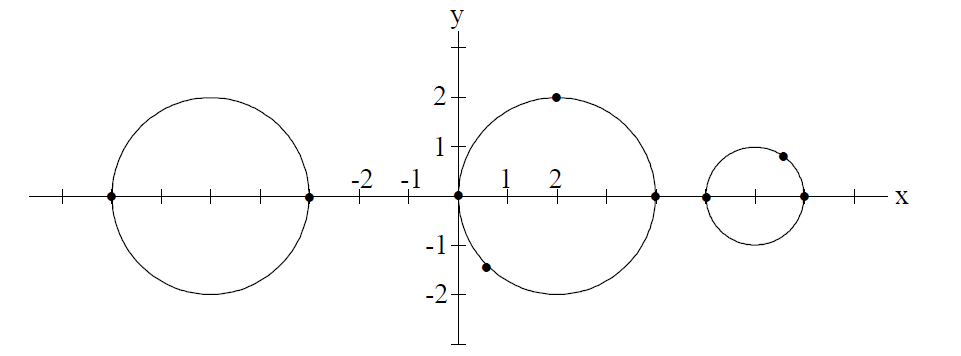

[This is another problem that has appeared in a MICS problem set.]

Professor Plum has fond memories of visiting a 3-ring circus as a child. When his grandson was learning about the x-y coordinate plane, he promised a trip to the circus if his grandson could complete the following challenge. Given a set of (x,  y) coordinates corresponding to points on three rings (i.e., circles), determine which points belong to which ring and  order the points within each ring clockwise from the left-most point. Professor Plum guarantees that:

 - the rings don't overlap
 - the ring centers are on the x-axis
 - the set of points include all points where the rings intersect the x-axis

Consider, the following three rings with points shown:



The set of points in no particular order would be:
(4.0, 0.0), (-3.0, 0.0), (-7.0, 0.0), (2.0, 2.0), (5.0, 0.0), (0.0, 0.0), (7.0, 0.0), (0.5, -1.3), (6.5, 0.9)
Professor Plum wants you to write a program to solve this challenge.

### Input
The first line contains the number of points to sorts from the three rings. Coordinates will be rounded to the nearest tenth. The second line contains pairs of floating point numbers corresponding to (x, y) points. For the above example, the input could be:

```plaintext
9
4.0 0.0 -3.0 0.0 -7.0 0.0 2.0 2.0 5.0 0.0 0.0 0.0 7.0 0.0 0.5 -1.3 6.5 0.9
```

### Output
Three lines of output corresponding to points belongs to each ring from left-to-right. The order of the points within each ring should be listed clockwise starting from the left-most point. The format of the output is shown below including a single space before each point and a single decimal place for each x and y value.

```plaintext
Ring 1: (-7.0,0.0) (-3.0,0.0)
Ring 2: (0.0,0.0) (2.0,2.0) (4.0,0.0) (0.5,-1.3)
Ring 3: (5.0,0.0) (6.5,0.9) (7.0,0.0)
```